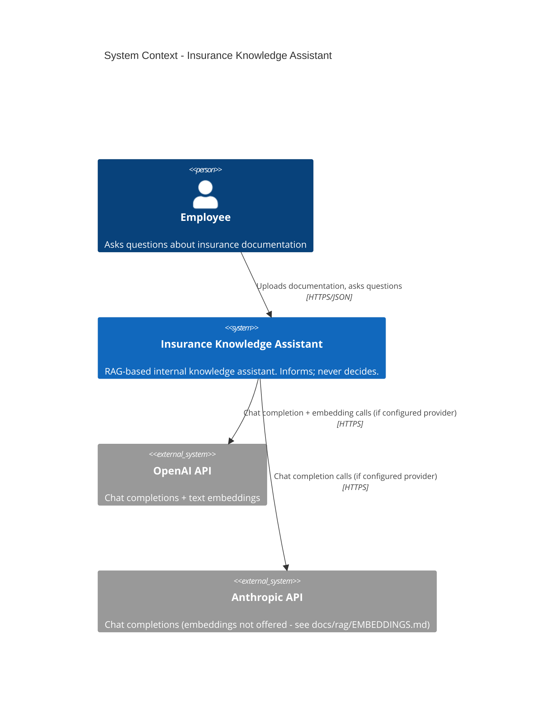
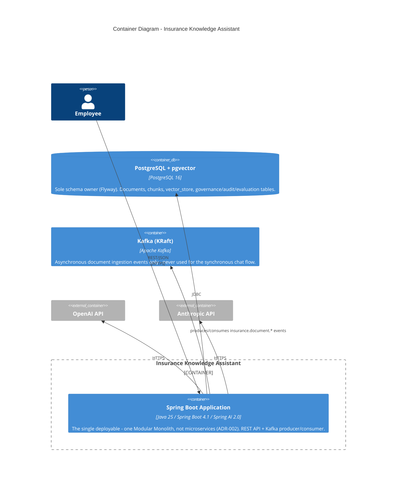

# C4 Model — Insurance Knowledge Assistant

Status: living document, created FASE 12 to fulfil `ARCHITECTURE.md`'s own forward reference
(present since FASE 0, never written until now). Reflects the **real, current** architecture
(post-FASE 11) - not an aspirational design. See `docs/architecture/COMPONENTS.md` for the
per-bounded-context component detail this document's C3 level only summarizes.

## Level 1 — System Context

`insurance-ai.ai.provider` selects `openai`, `anthropic`, or `fake` (a deterministic offline
adapter used for tests and credential-free demos - never a production option, see
`docs/resilience/RESILIENCE.md`). Only the selected provider's adapter is wired at startup.

## Level 2 — Containers

`docker-compose.yml` also runs a `kafka-ui` container (`localhost:8081`) - an operational
convenience for inspecting topics during local development, not part of the runtime request path.

## Level 3 — Components (inside the Spring Boot Application container)

The application is one deployable but internally organized as six bounded contexts (DDD), each
with its own `domain`/`application`/`ports` slice, communicating only through ports and (for
genuinely asynchronous document ingestion) Kafka events - never shared mutable state or
cross-context repository access (`ArchitectureTest` enforces the layering; nothing currently
enforces cross-context isolation beyond package convention, since Java has no first-class module
boundary here - see `docs/architecture/COMPONENTS.md` limitations).

| Bounded context | Primary inbound adapter | Key application services | Persistence |
|---|---|---|---|
| Document Management | `DocumentController` (`/api/documents`) | `RegisterDocumentUseCase`, ingestion pipeline consumers | `documents`, `document_versions`, `document_chunks` |
| RAG | `ChatController` (`/api/chat`) | `AskInsuranceKnowledgeUseCase`, `HybridRetrievalService` | `vector_store` (pgvector + full-text `content_tsv`) |
| GenAI Security | (no REST surface - invoked inline by RAG) | `InputGuardService` | none (stateless guards) |
| AI Governance | `GovernanceController` (`/api/governance`) | `AiSystemRegistryService`, `ModelRegistryService`, `PromptRegistryService`, `RiskAssessmentService` | `ai_systems`, `ai_models`, `prompts`, `risk_assessments` |
| AI Audit | `AuditController` (`/api/audit`) | `AuditService` | `ai_audit_records` (append-only) |
| AI Evaluation | `EvaluationController` (`/api/evaluation`) | `EvaluationRunnerService` | `evaluation_runs`, `evaluation_case_results` (append-only) |

Cross-context collaboration on the hot path (`POST /api/chat`): `ChatController` →
`AskInsuranceKnowledgeUseCase` (RAG) → `InputGuardService` (Security, blocks or logs) →
`HybridRetrievalService` (RAG) → `PromptRepository` (Governance, active prompt) → `LlmProvider`
port (adapter) → `AuditService` (Audit, records the outcome on every exit path). See
`docs/rag/RAG_DESIGN.md` for the full sequence.

## Level 4 — Code

Not diagrammed here (C4's own guidance: level 4 is optional and best read directly from the code
for a codebase this size). The class-level structure of each bounded context is documented in its
own `docs/` file (linked from `README.md`'s documentation map) and enforced by `ArchitectureTest`.
